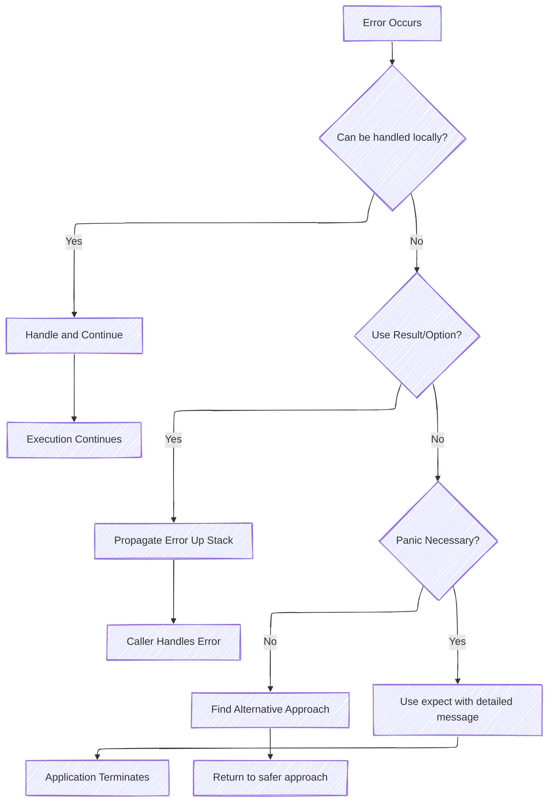
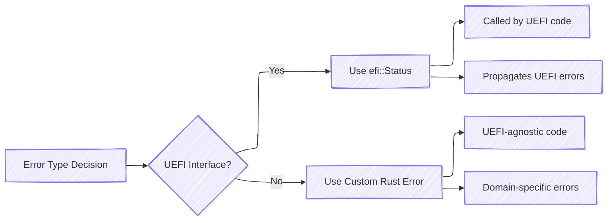

# Error Handling



## Avoiding Panics

Due to the difficulty of recovering from panics in firmware,
it is almost always preferable to return and propagate an error up the call stack rather than panic.

In order of most to least safe, code should:

1. **Propagate errors using `Result` or `Option`** whenever possible.
2. **For panics guarded by existing code** (for example, an `is_null` check before a `.as_ref()` call), provide a
   detailed message on how the existing code should prevent panics. Use `expect`, `log`, or `debug_assert` for such
   cases.
3. **For genuinely unrecoverable errors**, ensure a detailed error message is provided, usually through `expect`.
   Code should avoid `unwrap` except in test scenarios.

### Example

Consider the following example involving the `adv_logger`. Since the logger is not necessarily required to boot drivers
or continue normal execution, we can attempt to continue even if it is not properly initialized.

This code which `unwrap`s on logger initialization panics unnecessarily:

``` rust, no_run
# extern crate patina_adv_logger;
# extern crate log;
# extern crate patina;
# let hob_list = std::ptr::null();
use patina_adv_logger::{component::AdvancedLoggerComponent, logger::AdvancedLogger};
use log::LevelFilter;
use patina::{
    log::Format,
    serial::uart::UartNull,
};

static LOGGER: AdvancedLogger<UartNull> = AdvancedLogger::new(
    Format::Standard,
    &[],
    LevelFilter::Debug,
    UartNull {}
);

let mut component = AdvancedLoggerComponent::new(&LOGGER);
unsafe { component.init_advanced_logger(hob_list).unwrap() };
```

Consider replacing it with `match` and returning a `Result`:

``` rust, no_run
# extern crate patina_adv_logger;
# extern crate log;
# extern crate patina;
# let hob_list = std::ptr::null();
# use patina_adv_logger::{component::AdvancedLoggerComponent, logger::AdvancedLogger};
# use log::LevelFilter;
# use patina::{
#     log::Format,
#     serial::uart::UartNull,
# }; 
# static LOGGER: AdvancedLogger<UartNull> = AdvancedLogger::new(
#     Format::Standard,
#     &[],
#     LevelFilter::Debug,
#     UartNull {}
# );

let mut component = AdvancedLoggerComponent::new(&LOGGER);
match unsafe { component.init_advanced_logger(hob_list) } {
    Ok(()) => {},
    Err(e) => log::error!("Failed to init advanced logger: {e:?}"),
}
```

## `efi::Status` vs. Rust Errors



We mostly use two kinds of errors in `Result`s: `efi::Status` and Rust custom errors. Use `efi::Status` when errors
occur in UEFI interfaces (anything that's expected to be called by code across the UEFI spec defined ABI) to propagate
any errors occurring in UEFI internal code. Otherwise, use custom Rust errors in all UEFI-agnostic code. These can be
handled in UEFI interfaces, but should return errors specific to their functionality rather than a general status code.

### Examples

For example, the following excerpt is part of an `extern "efiapi"` function that is called by UEFI code. As such, it
returns an EFI status code, where the status is specific to the error state encountered.

``` rust
# extern crate r_efi;
use r_efi::efi;

extern "efiapi" fn get_memory_map(
    memory_map_size: *mut usize,
    memory_map: *mut efi::MemoryDescriptor,
    map_key: *mut usize,
    descriptor_size: *mut usize,
    descriptor_version: *mut u32,
) -> efi::Status {
    if memory_map_size.is_null() {
        return efi::Status::INVALID_PARAMETER;
    }

    let map_size = unsafe { memory_map_size.read_unaligned() };

    // ...
    
    # let required_map_size = 50usize;
    if map_size < required_map_size {
        return efi::Status::BUFFER_TOO_SMALL;
    }

    // ...

    return efi::Status::SUCCESS;
}
```

In contrast, lets take a look at the patina_internal_collections crate. This crate provides red-black tree and
binary search tree implementations. These implementations have no concept of any other code, so a custom error
type was created to clearly describe errors that occur if mis-using the crate.

Due to having a custom error type, consumers of patina_internal_collections (such as the GCD) can handle the granular
errors how it needs, while converting other errors to a higher level error type to be handled by the callers of the
GCD. This approach allows for detailed logging of issues and handling of more specific errors while also bubbling up
more generic errors up the chain.

In the example below, we see the chain of errors from a `patina_internal_collections::Error` -> `Gcd::Error` ->
`EfiError`. At each level, the caller can either handle the specific error, or convert it and pass it up to the
caller.

``` rust
# extern crate patina_internal_collections;
# extern crate patina;
use patina_internal_collections::Error as PicError;
use patina::error::EfiError;

// An error type for working with the GCD
pub enum Error {
    NotInitialized,
    InvalidParameter,
    OutOfResources,
    Unsupported,
    AccessDenied,
    NotFound,
}

// The GCD relies on `patina_internal_collections` for allocations, so lets make it easy to convert
// `patina_internal_collections` errors to our GCD error type.
impl From<PicError> for Error {
    fn from(value: PicError) -> Self {
        match value {
            PicError::OutOfSpace => Error::OutOfResources,
            PicError::NotFound => Error::NotFound,
            PicError::AlreadyExists => Error::Unsupported,
            PicError::NotSorted => Error::InvalidParameter,
        }
    }
}

// The GCD eventually bubbles up to external EFIAPI functions, so lets also make it easy to convert the `Error` type
// to `patina::error::EfiError`
impl From<Error> for EfiError {
    fn from(value: Error) -> EfiError {
        match value {
            Error::NotInitialized => EfiError::NotReady,
            Error::InvalidParameter => EfiError::InvalidParameter,
            Error::OutOfResources => EfiError::OutOfResources,
            Error::Unsupported => EfiError::Unsupported,
            Error::AccessDenied => EfiError::AccessDenied,
            Error::NotFound => EfiError::NotFound
        }
    }
}

// We can handle certain error types ourselves and coonvert / bubble any others up
fn handle_result_example(result: Result<(), PicError>) -> Result<(), Error> {
    match result {
        Ok(()) => Ok(()),
        Err(PicError::OutOfSpace) => /* Custom handle */ Ok(()),
        Err(err) => Err(err.into())
    }
}

// We can convert and bubble up all errors
fn handle_result_example2(result: Result<u32, PicError>) -> Result<u32, Error> {
    let inner = result.map_err(|err| Into::<Error>::into(err))?;
    Ok(inner * 2)
}
```

## Error Handling Best Practices in Patina

### Custom Error Types

For Patina components, define domain-specific error enums:

```rust
# extern crate core;
#[derive(Debug, Clone)]
pub enum ComponentError {
    NotInitialized,
    InvalidConfiguration(String),
    ServiceUnavailable,
    HardwareFault { device_id: u32, code: u16 },
    MemoryAllocation,
}

impl core::fmt::Display for ComponentError {
    fn fmt(&self, f: &mut core::fmt::Formatter<'_>) -> core::fmt::Result {
        match self {
            ComponentError::NotInitialized => write!(f, "Component not initialized"),
            ComponentError::InvalidConfiguration(msg) => write!(f, "Invalid configuration: {}", msg),
            ComponentError::ServiceUnavailable => write!(f, "Required service is unavailable"),
            ComponentError::HardwareFault { device_id, code } => {
                write!(f, "Hardware fault on device {}: error code {}", device_id, code)
            }
            ComponentError::MemoryAllocation => write!(f, "Memory allocation failed"),
        }
    }
}

impl core::error::Error for ComponentError {}
```

### Error Conversion Between Layers

When errors cross architectural boundaries in Patina:

- **Component → UEFI ABI**: Convert custom errors to `efi::Status`
- **UEFI ABI → Component**: Wrap `efi::Status` in domain-specific errors
- **Service → Component**: Use specific error types, not generic ones

## References

- [Rust Error Handling Book](https://doc.rust-lang.org/book/ch09-00-error-handling.html)
- [Error Handling Patterns](https://doc.rust-lang.org/rust-by-example/error.html)
